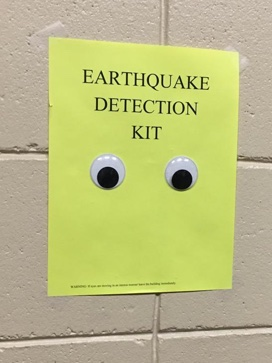

title: The Minimum Viable Product
date: 2022-01-14
tags: tech

This image has been circulating on LinkedIn as a tongue and cheek
example of a miminum viable product.

Of course, at least one of the responses was that it's not an MVP
without some extras. It needs 24/7 monitoring or a video camera with a
motion alarm.  It needs to detect quakes that occur off hours or when
you're otherwise away from the detector. The trouble with this
statement is the same as with the initial claimed MVP status of this
design - both claims make assumptions about requirements. The initial
claim assumes you're okay missing quakes when you're not around and
the second assumes you really do need to know. To identify an MVP, you
need to understand what it means to be viable. You need to understand
the goals and requirements of your stakeholders and user community.

Personally, I'm sympathetic to the initial claim that two googly eyes
stuck on a shet construction paper might actually be a viable
earthquake detector. As a Texan transplant to the Northeast, I'd never
experienced an earthquake until the 
[2011 Virginia earthquake](https://en.wikipedia.org/wiki/2011_Virginia_earthquake)
rattled the walls of my suburban Philly office. Not having any real
idea what was going on, my co-workers and I walked over to a wall of
windows to figure it out. Nothing bad happened, but it wasn't a smart
move, and exactly the sort of thing a wall mounted earthquake detector
might have helped avoid. The product doesn't do much, but it does do
something, and that might well be enough that it's viable.

This viability, though, is contingent on the fact that there was no
need to know about earthquakes that occurred off-hours. Add that
requirement in, and more capability is needed. The power of the MVP is
that it forces you to develop a better understanding of what it is
that you're trying to accomplish. Getting to an MVP is less about the
product and more about the requirements that drive the creation of
that product.

In a field like technology, where practicioners are often attracted to
the technology itself, the distinction between what is truly required
and what is not can be easy to miss. Personally, I came into this
field because I like building things. It's fun and rewarding to turn
an idea into a working system. The trouble with the MVP from this
point of view is that defining a truly minimum product may easily
eliminate the *need* to build something cool. The answer may well be
that nNo, you don't get to build the video detection system, because
you don't need it and your time is better spent elsewhere.  The notion
of the MVP inherently pulls you away from the act the build and forces
you to to consider that there may be no immediate value in the thing
you aim to build.

One of my first consulting engagments was years ago, for a bank
building out a power trading system. They wanted to enter the business
to hedge other trades, and the lack of a trading system to enforce
controls limits was the reason they couldn't. Contrary to the advice
of my team's leadership, they initially decided to scratch build a
trading system in Java. There were two parts of this experience that
spoke to the idea of understanding requirements and the scope of the
minimum viable product.

The first case can be boiled down to the phrase 'training issue'.
Coming from a background of packaged software development, my
instincts at the time were competely aligned around building software
that helps avoid user error.  In mass market software, you can't train
all of your users, so the software has to fill the gap. There's a
higher standard for viability in that the software is required to do
more and be more reliable.

This trading platform was different in that it was in-house software
with a user base known that numbered in the dozens. With a user base
that well and known small, it's feasable to just train everybody to
avoid bugs.  A crashing, high severity bug that might block a mass
market software release might just be addressed by training users to
avoid it. This can be much faster, which is important when the
software schedule is blocking the business from operating in the first
place. The software fix might not actually be required for the product
to be viable. This was less perfect software, and more about getting
to minimum viability and getting out of the way of a business that
needed to run.

The second part of the story is that most of the way through the first
phase of the build, the client dropped the custom build
entirely. Instead, they'd deploy a commercial trading platform with
some light customizations. There was a lot less to build, but it went
live much more quickly, particularly in the more complex subsequent
phases of the work. It turned out that none of the detailed
customizations enabled by the custom build were actually required.

Note that this is not fundementally a negative message. What the MVP
lets you do is lower the cost of your build by focusing on what is
truly required. In the case of a trading organization, it can get your
traders doing their job more quickly. In the case of an earthquake
detector, maybe it means you can afford more than just one. Lowering
the cost of your product can enable it to be used sooner and in more
ways than otherwise.

The concept of an MVP has power because it focuses your attention on
the actual requirements you're trying to meet. With that clearer
focus, you can achieve lower costs by reducing your scope. This in
turn implies you can afford to do more of real value with the limited
resources you have available.  It's not as much about doing less, as
it is about doingo more of value with the resources you have at
hand. That's a powerful thing, and something to keep in mind as you
decide what you really must build.
